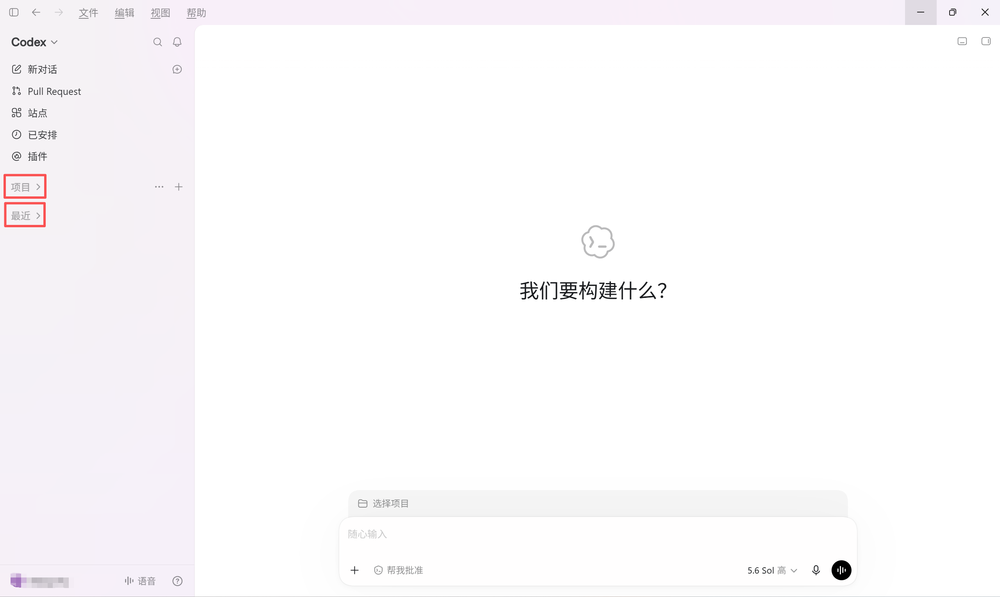
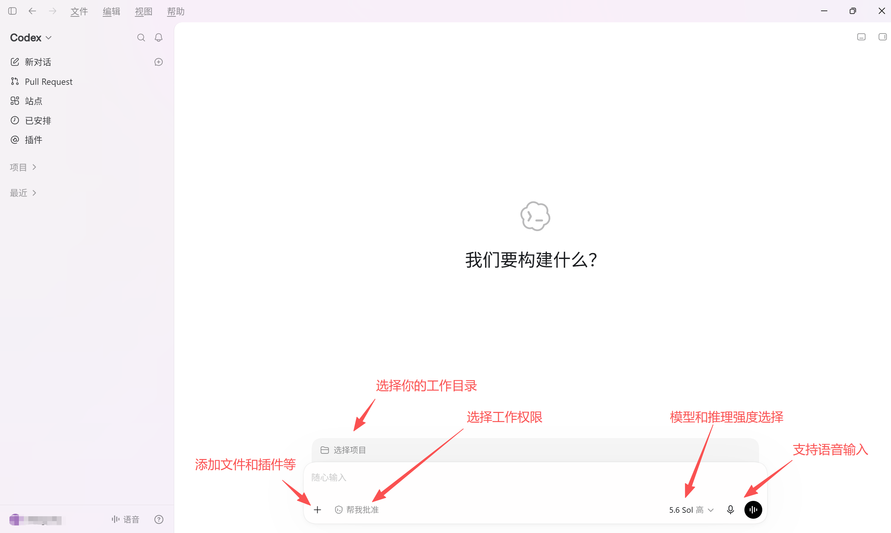
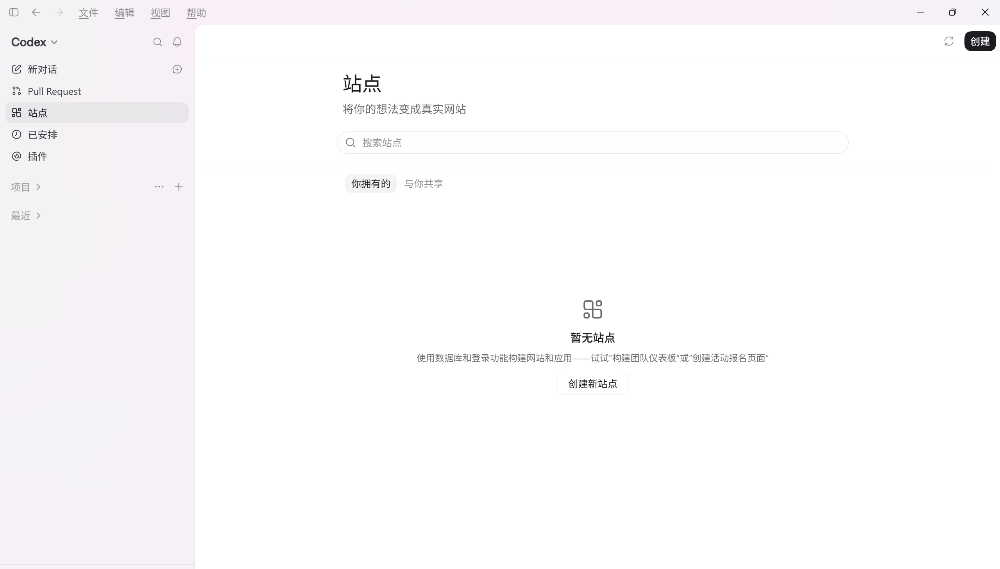
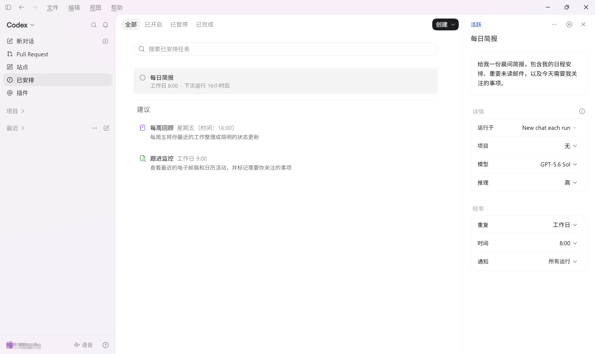
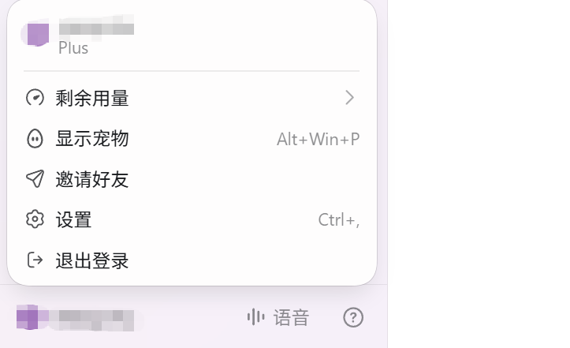
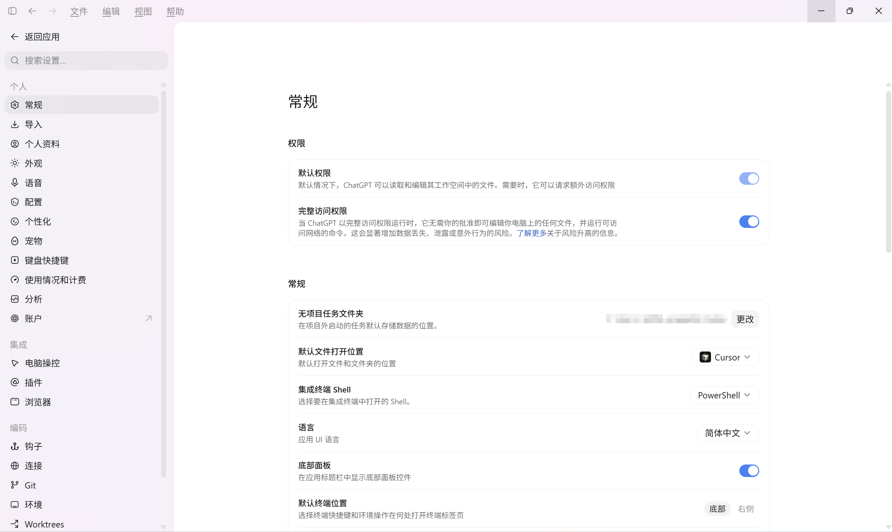

::: tip 最后核对
官方资料最后核对日期：2026-09-02。本章参考 [Codex App 官方文档](https://learn.chatgpt.com/docs/app)、[Codex App 设置](https://learn.chatgpt.com/docs/reference/settings)、[智能体审批与安全](https://learn.chatgpt.com/docs/agent-approvals-security)、[使用 Codex 审查 GitHub 拉取请求](https://learn.chatgpt.com/docs/third-party/github)、[已安排任务](https://learn.chatgpt.com/docs/automations) 等官方资料。界面说明以当前 Codex 桌面 App 实际版本为准，不同系统、地区、客户端版本和账号套餐下显示可能略有差异。
:::

# 了解 Codex 基本组成

## 认识对话和项目

打开 Codex，左侧栏就两个入口：**Chat（对话）** 和 **Project（项目）**，之前有过对话的话会显示最近。而最近 Codex 和 ChatGPT 进行了一个整合，所以页面正上方就可以直接切换二者开始你的工作。

**Chat 对话**

和 ChatGPT 网页版差不多，随手问问题。各对话互不相干，也不共享文件夹。

**Project 项目**

需要动本地文件时用它——写代码、改文档、做 PPT 都可以。项目里的所有对话共用同一个文件夹，方便一起管理。

在项目里下达指令后，Codex 的修改会直接应用到你本地文件夹中的文件。

## 对话框功能说明

Codex 的对话框和 ChatGPT 网页版类似，支持：

1. **添加上下文**：可以附加文件、截图或其他参考内容
2. **切换模型**：在不同模型之间切换

并额外支持：

3. **控制权限**：设定 Codex 在当前任务中的操作权限
4. **选择工作目录**：指定 Codex 在哪个本地文件夹下执行任务

## 插件与技能

包括 OpenAI 官方定制或推荐的插件与技能。

Skills 默认包含 Skills Creator、Skills Installer、OpenAI Docs 等技能，用来创建、安装技能，或获取 OpenAI 官方最新文档。在对话框中使用 `$` 即可调用 Skills：

插件是 OpenAI 定义的外部工具入口，也可能包含 Skills、MCP、脚本等能力。常见插件包括 Computer Use、Browser Use、PPT、Docs、Excel、Slack、GitHub 等。不同插件可能有额外配置。

## Pull Request

左侧栏中的 **Pull requests** 用来集中查看与 GitHub 仓库关联的拉取请求。打开某个 PR 后，Codex 可以读取代码变更和相关上下文，协助审查代码、解释修改、定位问题，或根据审查意见继续调整代码。

Codex 也可以帮助整理提交内容并生成 PR 标题和描述。实际可查看和操作的仓库取决于已连接的 GitHub 账号及其权限，最终是否合并仍以仓库的审查流程为准。

## 站点

左侧栏中的 **Sites（站点）** 用来创建、托管、迭代和分享网站、Web 应用或小游戏。你可以从一句需求或兼容的本地项目开始，让 Codex 生成页面、修改内容并完成托管，之后再回到 Sites 中继续管理和更新。

需要注意的是，Sites 生成的部署链接属于正式上线环境。发布前应先检查页面内容、功能和访问权限；如果暂时不想上线，可以让 Codex 只保存版本而不部署。

## 已安排

左侧栏中的 **已安排（Scheduled）** 用来集中查看和管理定时任务及其运行记录。你可以让 Codex 在指定时间或按固定周期在后台执行任务，例如检查项目变化、生成报告或持续监控更新；任务可以随时暂停、恢复或修改。

创建已安排任务时，需要填写要执行的指令，并选择项目、运行位置和执行频率。任务需要使用本地文件时，应保持电脑开机、Codex 桌面 App 运行，并确保项目文件夹仍然可以访问。

::: tip 注意
自动化任务以默认沙盒设置运行。若工具调用需修改工作空间外文件、访问网络或操作电脑应用，该操作将执行失败。可通过规则选择性允许特定命令在沙盒外运行。
:::

## 设置面板

点击左下角头像或设置图标可以打开设置面板。比起之前，多了一个桌面宠物功能还有一个好友邀请功能，邀请好友可以获得对应的额度。

左侧是设置菜单。里面包含丰富的配置选项，详情如下：

c

::: warning 先用默认配置
截图里的开关只是示例。尤其是「完全访问权限」、浏览器控制、电脑操控、钩子和 MCP 服务器，先按任务逐步开启。配置选项可参考如下。
:::

## 设置说明
大部分情况下都是保持默认配置即可。配置很多时候都是按需开启。

### 个人

  <section class="setting-card">
    

      <strong>常规</strong>
      <ul>
        <li>
          <strong>权限</strong>：提供三个权限选项。
          <ul>
            <li><strong>默认权限</strong>：Codex 可以读取和编辑当前工作区中的文件并运行常规本地命令；访问网络或超出工作区边界前会请求你的批准。</li>
            <li><strong>自动审核</strong>：也称“替我审批”。工作区边界与默认权限相同，但额外访问请求会交给模型自动审核；自动审核仍可能判断错误。</li>
            <li><strong>完全访问权限</strong>：Codex 可以修改电脑上的任意文件，并在无须逐次批准的情况下运行可联网命令，数据丢失或泄露风险显著提高。</li>
          </ul>
        </li>
        <li><strong>常规选项</strong>：可配置无项目任务文件夹、默认文件打开位置、集成终端 Shell、应用界面语言和底部面板等选项。</li>
        <li><strong>对话与运行</strong>：可要求使用 Ctrl + Enter 发送多行提示、在本地任务运行时阻止电脑休眠，并设置工作过程中发送的新消息是引导当前轮次还是排入下一轮。</li>
        <li><strong>弹出窗口</strong>：可将当前对话弹出为独立窗口，并按需设置为始终置顶。</li>
        <li><strong>通知</strong>：可设置轮次完成通知的出现时机，以及应用是否提示你授予系统通知权限。</li>
      </ul>
    

    
<strong>推荐配置选项</strong>：大多数任务从默认权限开始；只有任务确实需要时再启用自动审核或完全访问权限。本地长任务可按需开启运行时防休眠。

  </section>

  <section class="setting-card">
    

      <strong>个人资料</strong>
      
查看和更新账号资料与使用活动。

      <ul>
        <li><strong>资料</strong>：头像、显示名称、用户名和个人资料卡。</li>
        <li><strong>活动统计</strong>：累计 token、峰值 token、连续使用天数、最长任务和 token 活动等信息。</li>
      </ul>
    

    
<strong>推荐配置选项</strong>：保持默认即可

  </section>

  <section class="setting-card">
    

      <strong>导入</strong>
      
从 Claude Code、Claude Cowork 或 Cursor 导入受支持的指令、设置、技能、插件、项目和近期工作。导入不会修改或删除原有智能体配置，也可以按需开启自动同步。

    

    
<strong>推荐配置选项</strong>：只有需要迁移现有工作时再使用；导入后检查仍需授权的插件和连接。

  </section>

  <section class="setting-card">
    

      <strong>外观</strong>
      
调整应用界面和配色方案。可选择基础主题，设置强调色、背景色、前景色、UI 字体和代码字体，也可以配置半透明侧边栏、对比度、指针光标和字号，并复制或分享自定义主题。

    

    
<strong>推荐配置选项</strong>：按照自己的喜好即可。

  </section>

  <section class="setting-card">
    

      <strong>语音</strong>
      
设置语音对话快捷键。语音对话用于与 ChatGPT 实时交流和协调任务；语音听写则只把语音转换成发送前可编辑的提示文字。具体可用性取决于套餐、地区和工作区设置。

    

    
<strong>推荐配置选项</strong>：需要持续语音交流时使用语音对话，只需输入文字时使用语音听写。

  </section>

  <section class="setting-card">
    

      <strong>配置</strong>
      
管理 Codex 的默认行为、执行边界和 config.toml 配置。

      <ul>
        <li><strong>自定义 config.toml 设置</strong>：Codex 的核心配置文件。详情见：<a href="../advanced/09-config-toml.html">config.toml 参考</a></li>
        <li><strong>工作空间依赖项</strong>：查看、诊断或重置 Codex 随附的 Node.js 和 Python 运行环境，并按需安装工作空间依赖项。</li>
      </ul>
    

    
<strong>推荐配置选项</strong>：批准策略用按请求；沙盒用只读或工作区写入；联网按任务开启。

  </section>

  <section class="setting-card">
    

      
个性化

      
选择友好、务实或无预设性格，并配置自定义指令。个人自定义指令会写入个人级 AGENTS.md；在可用时，也可以启用记忆，让 ChatGPT 在后续工作中使用过去对话中的有用上下文。

    

    
<strong>推荐配置选项</strong>：自定义指令写跨项目偏好。

  </section>

  <section class="setting-card">
    

      <strong>宠物</strong>
      
选择内置或自定义的动态宠物，并控制宠物浮层的显示状态。宠物属于可选的界面功能，不影响 Codex 执行任务。

    

    
<strong>推荐配置选项</strong>：按个人喜好开启或关闭。

  </section>

  <section class="setting-card">
    

      <strong>键盘快捷键</strong>
      
按命令名称或按键组合搜索快捷键，修改按键绑定，或将自定义快捷键恢复为默认值。

    

    
<strong>推荐配置选项</strong>：保持默认。后续根据需要自定义修改。

  </section>

  <section class="setting-card">
    

      <strong>使用情况和计费</strong>
      
查看当前套餐、用量限制和计费状态。具体显示内容取决于账号类型和工作区。

    

  </section>

### 集成

  <section class="setting-card">
    

      <strong>MCP 服务器</strong>
      
给 Codex 接入外部工具和共享信息，例如文档、设计工具或内部系统。MCP 服务器负责定义工具、处理身份验证、返回结构化数据并执行外部操作。

    

    
<strong>推荐配置选项</strong>：根据项目需要配置 MCP。更多请看<a href="../advanced/03-skills-plugins-mcp.html">技能与插件</a>。

  </section>

  <section class="setting-card">
    

      <strong>插件</strong>
      
安装和管理可复用的能力包。插件可以包含技能、连接器、MCP 服务器、浏览器扩展、钩子或已安排任务模板；安装后通常需要在新对话中使用。

    

    
<strong>推荐配置选项</strong>：只安装任务需要且来源可信的插件，并检查其权限、连接和钩子。

  </section>

  <section class="setting-card">
    

      <strong>浏览器</strong>
      
让 Codex 打开网站、获取最新信息并在网页中执行操作。内置浏览器使用独立于日常浏览器的资料和历史记录；可在这里安装或启用浏览器插件，并管理浏览数据、下载位置以及允许或阻止的网站。

    

    
<strong>推荐配置选项</strong>：网页内容应视为不受信任的上下文；仅允许任务需要的网站，在共享敏感信息或执行重要操作前先检查页面和操作内容。

  </section>

  <section class="setting-card">
    

      <strong>电脑操控</strong>
      
让 Codex 查看并操作 macOS 或 Windows 的图形界面，适合命令行或结构化集成无法完成的桌面应用操作。需要安装并启用 Computer Use 插件，再在设置中检查应用访问权限。

    

    
<strong>需要注意</strong>：在 Windows 上，目标应用需保持在当前活动桌面，Computer Use 会移动指针、输入文字并占用前台。应限定任务范围，并在继续前检查权限请求。

  </section>

### 编码

  <section class="setting-card">
    

      <strong>钩子</strong>
      
在 Codex 的智能体循环和会话生命周期事件中运行脚本或 MCP 工具。可用于日志、敏感信息检查、记忆整理、验证检查和按目录调整提示。详情见：<a href="../advanced/06-hooks.html">Hooks</a>。

    

    
<strong>推荐配置选项</strong>：默认无需配置。启用非托管钩子前，应检查并信任其具体定义；钩子发生变化后需要重新审核。

  </section>

  <section class="setting-card">
    

      <strong>连接</strong>
      
管理 Codex Remote 设备连接。可在桌面 App 中生成二维码，用登录同一 ChatGPT 账号和工作区的手机配对；之后可从手机启动任务、查看进度、批准操作和检查代码变更。电脑需保持唤醒并联网。

    

  </section>

  <section class="setting-card">
    

      <strong>Git</strong>
      
让 Codex 按你的偏好处理 Git。可配置分支前缀、Pull Request 合并方式、侧边栏 Pull Request 图标、强制推送、草稿 Pull Request、旧工作树自动清理与保留数量，以及提交信息和 Pull Request 标题或描述的生成指令。

    

    
<strong>推荐配置选项</strong>：保持默认即可。视实际开发需要而修改。

  </section>

  <section class="setting-card">
    

      <strong>环境</strong>
      
为指定项目目录配置构建和运行方式，包括设置脚本、清理脚本和自定义操作，例如安装依赖、构建项目、启动开发服务器或运行测试。

    

    
<strong>推荐配置选项</strong>：当你需要频繁地使用命令来打开一个项目时，考虑配置。

  </section>

  <section class="setting-card">
    

      <strong>工作树</strong>
      
在同一个 Git 仓库中为不同任务创建相互独立的检出目录，让多个对话并行工作而不干扰本地工作区。工作树仅适用于 Git 仓库，并可通过 Handoff 在本地检出目录与工作树之间移动对话和代码。

    

    
<strong>推荐配置选项</strong>：适合并行或后台任务。完成后根据需要创建分支或移交到本地，并清理不再使用的工作树。

  </section>

### 已归档

  <section class="setting-card">
    

      <strong>已归档对话</strong>
      
查看已归档对话的日期和项目上下文，并使用“取消归档”将对话恢复。

    

  </section>

::: tip 注意
设置页里的名称会随着客户端迭代变化。遇到和教程截图不一致时，先看 OpenAI 官方的 [Codex App 官方文档](https://learn.chatgpt.com/docs/app)，再回到本教程查中文场景解释。
:::

## 下一步

下一步：[用 Codex 完成第一个任务](./06-first-task.md)。
